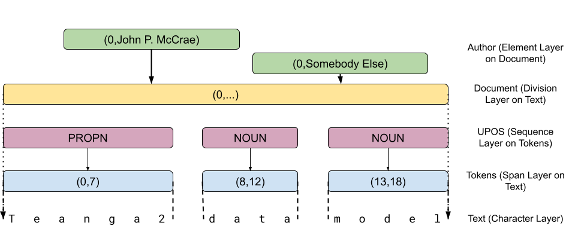

Teanga 2 Data Model
===================

The core idea of Teanga2 is the data model which descibes how the data is 
represented and processed by services and stored in Teanga2 backends.

Layers
------

The Teanga2 data end consists of a set of layers that provide annotations.
Layers are typed into the following kinds

* **Character Layers**: These layers represent text. A character layer consists
of the unicode characters in that layer and the indexes correspond to each
Unicode character. As such, while these layers are most frequently encoded as 
UTF-8, other encodings can be handled as well.
* **Span Layers**: Span layers consist of annotations with a start position,
end position and a data value. The indexes refer to the position in the 
sublayer. Span layers are the most flexible form of annotation and are typically
used to represent tokenisation and annotations such as named entities and terms.
* **Division Layers**: Division layers have a start position and a data value. The end 
position of a div layer is assumed to be the start position of next annotation
in this layer or the largest index in the sublayer. Div layers are typically 
used to divide the text into sections such as sentences, paragraphs and chapters
* **Element Layers**: Element layers have a start position and a data value. The
end position is assumed to be the start position plus one. Element layers are 
most typically used for indicating metadata properties and a few annotations
* **Sequence Layers**: A sequence layer has only a data value on each annotation.
Sequence layers are assumed to be in one-to-one correspondance with the indexes
of the sublayer. These are typically used when there is a value for every 
word (or sentence or paragraph) such as in part-of-speech tagging.



An example of each layer type is given in the above image and can be represented
in YAML as follows:

```yaml
_meta:
    text:
        type: characters
    tokens:
        type: span
        on: text
    upos:
        type: seq
        on: tokens
        data: ["ADJ", ... "X"]
    document:
        type: div
        on: text
        value: [[0]]
    author:
        type: element
        on: document
        data: str
abcd:
    text: "Teanga2 data model"
    tokens: [[0,7], [8,12], [13,18]]
    upos: ["PROPN", "NOUN", "NOUN"]
    author: [[0, "John P. McCrae"], [0, "Somebody Else"]]
```

Data
----

Each annotation in a Teanga 2 layer can have data. The folllowing types of data
are available

* **None**: No data is associated with annotation. This is frequently used for
layers that only divide the text, such as tokens, sentences or chapters
* **String**: A string value, such as the lemma for an entry.
* **Enumeration**: A string value, but limited to a list of possible values.
* **Link**: A reference to another annotation. If not specified this link is 
assumed to refer to an annotation in the same layer by its index, however you
may specify another layer by means of the `target` property.
* **Typed Link**: A link with a type, combines the enumeration and link data
types

As an example consider this (simplified) encoding of Universal Dependencies
data

```yaml
_meta:
  text:
    type: characters
  words:
    type: span
    on: text
    data: none
  upos:
    type: seq
    on: words
    data: ["DET","NOUN","VERB"]
  dep:
    type: seq
    on: words
    data: link
    link_types: ["root","nsubj","dobj"]
    target: dep
0aBC:
  text: "this is an example"
  words: [[0,4], [5,7], [8,10], [11,17]]
  upos: ["DET", "VERB", "DET", "NOUN"]
  dep: [[1, "nsubj"], [1, "root"], [2, "det"], [1, "dobj"]]
```

In addition, the metadata may define a `value` for the layer. In this case,
the layer does not need to be specified in the document and will be assumed 
to be the default value. The primary use for this is in defining document
layers as above

Corpus Model
------------

The corpus model of Teanga2 consists of a (ordered)
sequence of documents which in turn
consists of an (unordered) sequence of words. In addition, there are two meta
properties `_meta` and `_order` which give the layer descriptions and the 
order of the documents in the text.

Each document is indexed by initial characters
the Base64 encoding of the SHA-256 of the UTF-8 representation of the text. The 
text representation consists of all character layers ordered by their key with
the key appended before the text. Keys and text should by a zero byte (`\u0000`). 
For example the following document:

```yaml
en: Hello!
de: Guten Tag!
```

The string to encode is as follows:

```python
>>> rep = "de\x00Guten Tag!\x00en\x00Hello!\x00"
>>> b64encode(sha256(rep.encode("utf-8")).digest()).decode("ascii")
'SpKHmfUJ1IkFXito5Me/ssLZ0Xx+ma5jjXTDb2qXs88='
```

By default only the first 4 characters of the key are used so the representation
of this document would be

```yaml
SpKH:
    en: Hello!
    de: Guten Tag!
```

All keys in the document should be unique and are used to check the validity of
the input. 

These keys are used by the `_order` meta to give the order of documents. In
many serializations this may be omitted and instead the order of the keys in
the document may be used instead of an explicit order.

Documentation and RDF
---------------------

Teanga2 is linked-data-aware and this can be used to provide documentation to 
the user. This can be done with the special `_uri` property that can appear at
several points in the document

```yaml
_meta:
    _uri: https://jmccrae.github.io/teanga2/meta/basic.yaml
    author:
        on: document
        data: str
        _uri: https://jmccrae.github.io/teanga2/props/author.html
ABCD:
    _uri: corpus/doc1.yaml
```

As a property directly under `_meta` this indicates that this format will build
on another model and includes all the layers of that corpus into this corpus.

As a property of a layer, it indicates an description of the property. This 
should ideally refer to an HTML page with embedded Turtle or RDFa annotation.

If put directly as a document, this indicates that the document is stored in
another file and the YAML document is effectively copied directly in as this
document.


